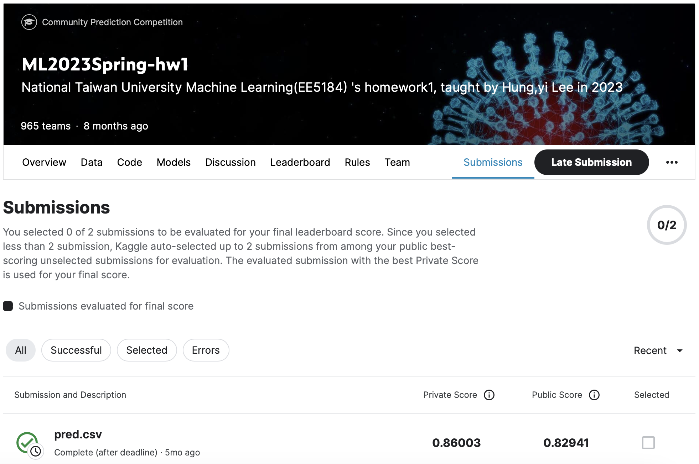
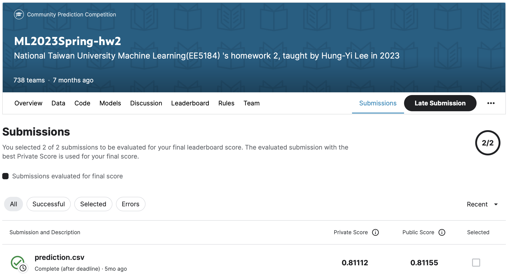
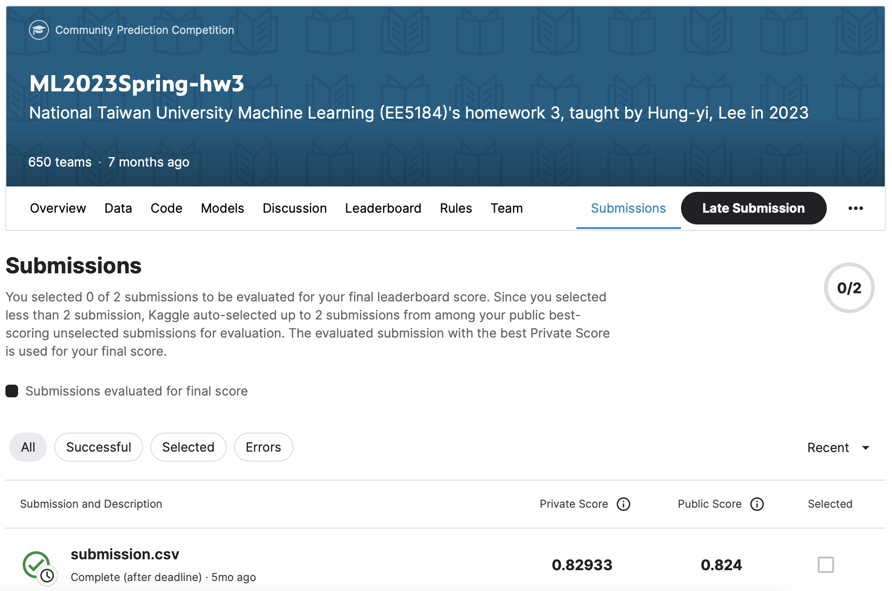

# ML2023-Spring
课程网址：https://speech.ee.ntu.edu.tw/~hylee/ml/2023-spring.php
# HW01:
COVID-19 Cases Prediction (Regression)

| Baseline | Public Score | Private Score |
| :----: | :----: | :----: |
| boss | 0.81456 | - |
| strong | 0.92619 | - |
| medium | 1.15678 | - |
| simple | 1.96993 | - |

# HW02:
Solve a classification problem with deep neural networks (DNNs)

| Baseline | Public Score | Private Score |
| :----: | :----: | :----: |
| boss | 0.83017 | - |
| strong | 0.74944 | - |
| medium | 0.66440 | - |
| simple | 0.49798 | - |

# HWO3:
Solve image classification with convolutional neural networks(CNN).

| Baseline | Public Score | Private Score |
| :----: | :----: | :----: |
| boss | 0.874 | - |
| strong | 0.814 | - |
| medium | 0.700 | - |
| simple | 0.637 | - |

# HW04:
Classify the speakers of given features. 

| Baseline | Public Score | Private Score |
| :----: | :----: | :----: |
| boss | 0.93175 | - |
| strong | 0.88500 | - |
| medium | 0.81750 | - |
| simple | 0.66025 | - |

